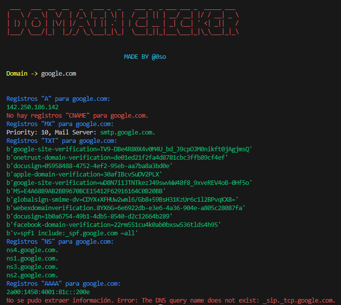

# Domain Info Checker

Este script proporciona información sobre un dominio al realizar consultas DNS. Puede ser utilizado para obtener datos como direcciones IP asociadas, registros de servicio, servidores de correo, entre otros.



## Características

- Consulta registros "A" para obtener direcciones IPv4 asociadas al dominio.
- Busca registros "CNAME" para obtener nombres canónicos.
- Obtiene registros "MX" para identificar servidores de correo asociados al dominio.
- Recupera registros "TXT" para obtener información de texto asociada al dominio.
- Consulta registros "NS" para obtener servidores de nombres del dominio.
- Busca registros "AAAA" para obtener direcciones IPv6.
- Recupera registros "SRV" para obtener detalles de servicios asociados al dominio.

## Uso

1. Ejecuta el script.
2. Ingresa el dominio que deseas analizar cuando se solicite.
3. Observa la información detallada proporcionada para el dominio.

## Requisitos

- Python 3.x
- Bibliotecas Python: `dns.resolver`, `colorama`, `pyfiglet`

## Instalación de dependencias

Para instalar las dependencias necesarias, asegúrate de tener Python 3.x instalado y luego ejecuta el siguiente comando en tu terminal:

```bash
pip install -r requirements.txt
```

## Ejemplo de Ejecución

```bash
python domain_info_checker.py
```